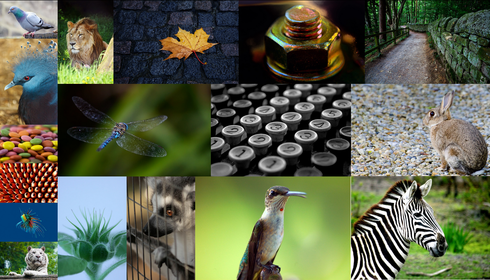

# Image Tiling

Simple algorithm for arranging set of images into a tile.

The algorithm focuses on:
* minimum scaling on average
* and not decreasing image quality.

The functionality can be used to build cool galleries.
Example gallery can be seen by running those commands:

```sh
ruby server.rb &
firefox 'http://localhost:8000/gallery.rhtml'
# you could refresh the page to see different images and arrangement
```

## Tile Examples





